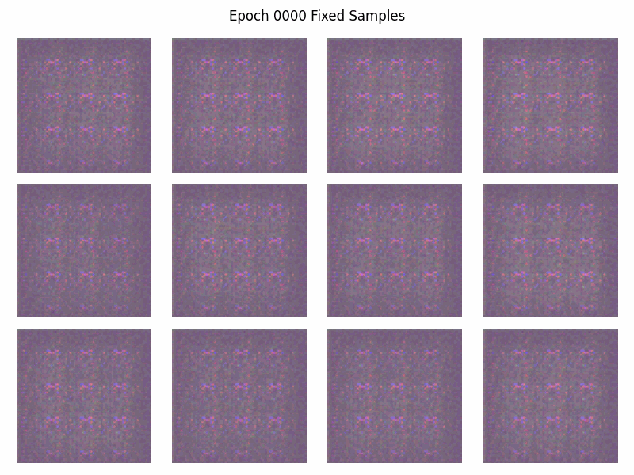

# WGAN-GP

A custom **WGAN-GP training system in TensorFlow**, built around explicit multi-step critic optimization, accelerator-independent model execution, distributed training and resumable long-running experiments.

The project contains two implementations developed several years apart:

* **Experimental implementation:** A Keras-based WGAN-GP focused on generator/critic architecture experimentation and reusable model blocks.
* **Distributed implementation:** A complete re-engineering of the training system, separating model computation, training orchestration, accelerator strategy and monitoring.

The second implementation is the primary version of the project.

<p align="center">
  
</p>

The animation shows a fixed set of 12 generated samples throughout training, making the progression of the generator directly observable rather than evaluating only the final model state.

## Overview

The model is trained unconditionally: a random latent vector is transformed into a 64×64 RGB image of a cat.

The implementation follows the WGAN-GP formulation, including the Wasserstein critic objective and gradient penalty, but the training system is deliberately built around the requirements of the algorithm rather than around the default Keras training loop.

The primary implementation was trained on **16,000 cat-face images for 1,000 epochs**, using `tf.distribute.MirroredStrategy` across two NVIDIA T4 GPUs. The complete run, including model state, metrics and generated images, was recorded during training, and can be found [here](https://www.kaggle.com/).

; TODO update kaggle link

## Why a Custom Training System?

The original implementation used `tf.keras.Model.fit()`, which works naturally for conventional single-batch training steps. WGAN-GP introduces a different requirement: the critic is updated multiple times for each generator update, and each critic update should receive a fresh batch.

Rather than repeatedly reusing the batch supplied to `fit()`, the revised implementation owns the training loop explicitly.

This also provided a clean boundary for distributed execution. The model itself remains unaware of whether it is being executed on a CPU, a single GPU or multiple accelerators; the surrounding training system is responsible for execution strategy and orchestration.

The result is a separation between:

```text
Strategy
   ↓
Trainer
   ↓
 Model

Monitor ← training state / metrics / generated samples
```

`Strategy` determines the execution environment, `Trainer` controls the training procedure, `Model` contains the generator/critic computation, and `Monitor` handles the state and observations produced during training.

## Architecture

### Model

The model contains the generator and critic, and defines their training behaviour, but does not contain accelerator-specific logic.

Generator and critic are ordinary TensorFlow models, allowing the architecture to be changed independently of the training machinery.

### Trainer

`Trainer` owns the training loop and coordinates:

* generator updates
* multiple critic updates
* fresh batches for critic iterations
* distributed execution

The training step is compiled with `tf.function` for TensorFlow graph execution.

### Strategy

Accelerator configuration is isolated from the model and trainer implementation.

The primary run uses:

```python
tf.distribute.MirroredStrategy()
```

with two NVIDIA T4 GPUs.

The implementation is structured to support other TensorFlow distribution strategies, including TPU execution through `TPUStrategy`.

### Monitor

`Monitor` handles the state and observability of long-running training:

* metric and history tracking
* TensorBoard logging
* fixed-sample image generation
* progressive visualization
* image saving
* checkpointing

The current model state is checkpointed after every epoch, with a rolling window of four checkpoints. Training can therefore be resumed after an interruption without restarting from the beginning.

The latest checkpoint can be restored with:

```python
monitor.restore_checkpoint()
```

## Training

The primary distributed run:

| Property     |                  Value |
| ------------ | ---------------------: |
| Dataset      | 16,000 cat-face images |
| Resolution   |            64×64×3 RGB |
| Training     |          1,000 epochs  |
| Hardware     |      2× NVIDIA T4 GPUs |
| Distribution |     `MirroredStrategy` |
| Runtime      |                ~4h 15m |
| Generation   |          Unconditional |

The training run produced detailed, recognizable cat-face samples. The full progression is captured through a fixed latent sample set, while metrics, model state and generated images are persisted by the monitor.

The animation above shows the progression of this run specifically.

## Implementations

### `wgan_gp_experimental.ipynb`

The original implementation is centered on model experimentation.

It implements WGAN-GP using the Keras model and callback APIs, with:

* custom generator and critic architectures
* reusable generator/critic blocks
* Wasserstein critic loss
* gradient penalty via `tf.GradientTape`
* custom learning-rate schedules
* custom checkpointing and visualization callbacks
* configurable image generation and training telemetry

The generator and critic architectures were developed under a **4 GB VRAM constraint**, making architectural experimentation an important part of the project.

### `wgan_gp_distributed.ipynb`

The revised implementation focuses on the training system itself.

It replaces the original Keras-driven training loop with explicit orchestration and introduces:

* custom `Trainer`
* execution strategy abstraction
* distribution-aware training
* explicit fresh-batch critic updates
* `tf.function` graph compilation
* fixed-shape execution, to avoid unnecessary retracing
* dedicated monitoring and checkpoint management
* resumable long-running training

This is the primary implementation and the recommended starting point.

## Running

; TODO update link

The distributed version is [available on Kaggle](https://www.kaggle.com/), includes the notebook and dataset, and can be run immediately with the provided environment, requiring no further setup.

Supports multi-GPU, single-GPU and CPU-only training by default.
To enable TPU training, set the appropriate strategy with:

```python
strategy = get_strategy('tpu')
```

Note that neither Kaggle nor Google Colab currently supports TPUs with TensorFlow due to a compatibility issue with JAX.

## References

The WGAN-GP implementation is based on the algorithm described in:

**Gulrajani et al., *Improved Training of Wasserstein GANs*, NeurIPS 2017.** [<sup>arXiv</sup>](https://arxiv.org/abs/1704.00028)

The implementation is my own and was developed directly from the paper's mathematical formulation.
